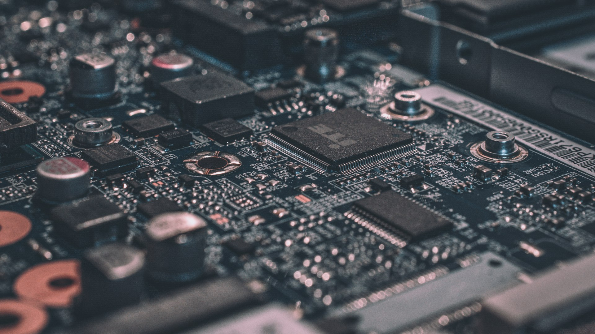

# SKILL: Fronet — Búsqueda y Descarga de Imágenes
**Propósito:** Buscar imágenes libres de derechos en Unsplash y Pexels adecuadas para cada sección del sitio web de Fronet Tecnología SRL, y producir los comandos `curl` listos para descargar cada imagen con su nombre de archivo correcto en `assets/img/`.

---

## CÓMO USAR ESTA SKILL

1. Lee este archivo completo antes de empezar.
2. Para cada sección listada, busca en Unsplash y Pexels usando los queries provistos.
3. Elige la imagen que mejor cumpla los criterios de selección.
4. Produce como output un bloque de comandos `curl` y una tabla de referencia.
5. Nunca uses imágenes que muestren logos de marcas competidoras o personas con expresiones negativas.

---

## CRITERIOS DE SELECCIÓN DE IMÁGENES

### Estilo visual requerido
- **Tono:** Corporativo, profesional, limpio. Nada genérico de "stock photo" con sonrisas forzadas.
- **Paleta compatible:** Imágenes con tonos azules, grises, blancos y negros. Evitar imágenes predominantemente rojas, verdes o amarillas que choquen con la paleta del sitio.
- **Iluminación:** Preferir fotos bien iluminadas, con fondo neutro o desenfocado.
- **Resolución mínima:** 1200px de ancho para imágenes de hero/banner. 800px para secciones. 600px para tarjetas.
- **Orientación:**
  - Hero/Banner → landscape (16:9 o 3:2)
  - Split sections → landscape o cuadrada
  - Cards de servicios → cuadrada o 4:3
  - Productos → cuadrada (1:1)

### Lo que NUNCA usar
- Imágenes con texto incrustado visible (titulares, precios, marcas)
- Logos de empresas competidoras (Dell, Lenovo, Samsung con branding prominente)
- Personas con teléfonos móviles en primer plano (se ve anticuado)
- Escenas de oficinas años 90 (madera oscura, monitores CRT)
- Imágenes pixeladas o con marca de agua

---

## APIs DE BÚSQUEDA

### Unsplash
```
URL base: https://api.unsplash.com/search/photos
Parámetros: ?query=QUERY&per_page=5&orientation=ORIENTACION
Headers: Authorization: Client-ID TU_ACCESS_KEY

Endpoint de descarga directa (sin API key, para uso en ):
https://images.unsplash.com/photo-ID?w=1200&q=80&auto=format&fit=crop
```

### Pexels
```
URL base: https://api.pexels.com/v1/search
Parámetros: ?query=QUERY&per_page=5&orientation=landscape
Headers: Authorization: TU_API_KEY

Las URLs de Pexels son directas desde la respuesta JSON en:
response.photos[0].src.large2x  (para heroes)
response.photos[0].src.large    (para secciones)
response.photos[0].src.medium   (para tarjetas)
```

> **Nota para Claude Code:** Si no tienes API keys configuradas, usa el método alternativo de búsqueda web descrito al final de este archivo.

---

## MAPA COMPLETO DE IMÁGENES POR PÁGINA Y SECCIÓN

### INDEX.HTML — INICIO

| ID | Sección | Uso | Orientación | Nombre de archivo |
|----|---------|-----|-------------|-------------------|
| img-hero-bg | Hero background (sutil) | Textura tecnológica de fondo | landscape | `hero-bg.jpg` |
| img-hero-card | Tarjeta flotante del hero | Persona trabajando en computadora | cuadrada | `hero-card.jpg` |
| img-service-renta | Card: Renta impresoras | Impresora de oficina moderna | cuadrada | `service-renta-impresora.jpg` |
| img-service-soporte | Card: Soporte técnico | Técnico reparando computadora | cuadrada | `service-soporte.jpg` |
| img-service-cctv | Card: CCTV | Cámara de seguridad instalada | cuadrada | `service-cctv.jpg` |
| img-service-laptop | Card: Laptops | Laptop abierta sobre escritorio | cuadrada | `service-laptop.jpg` |
| img-service-redes | Card: Redes | Cables de red / switch / rack | cuadrada | `service-redes.jpg` |
| img-service-tecnico | Card: Técnico impresoras | Técnico revisando impresora | cuadrada | `service-tecnico-impresora.jpg` |
| img-printer-section | Sección impresoras | Impresora HP/Canon profesional | landscape | `impresora-seccion.jpg` |
| img-cta-soporte | CTA soporte | Técnico con laptop, profesional | landscape | `cta-soporte.jpg` |

### NOSOTROS.HTML

| ID | Sección | Uso | Orientación | Nombre de archivo |
|----|---------|-----|-------------|-------------------|
| img-about-team | Sección principal | Equipo de trabajo / oficina moderna | landscape | `about-team.jpg` |
| img-about-office | Historia | Interior de tienda tecnológica | landscape | `about-office.jpg` |
| img-empleos | Sección empleos | Persona en entrevista / trabajo de oficina | landscape | `empleos.jpg` |

### SERVICIOS.HTML

| ID | Sección | Uso | Orientación | Nombre de archivo |
|----|---------|-----|-------------|-------------------|
| img-srv-renta | Renta impresoras | Impresora multifuncional de oficina | landscape | `srv-renta-impresora.jpg` |
| img-srv-soporte-pc | Soporte computadoras | Técnico reparando PC / motherboard | landscape | `srv-soporte-pc.jpg` |
| img-srv-cctv | Instalación CCTV | Instalación de cámara en pared | landscape | `srv-cctv-instalacion.jpg` |
| img-srv-laptop | Reparación laptops | Laptop abierta siendo reparada | landscape | `srv-reparacion-laptop.jpg` |
| img-srv-redes | Instalación redes | Rack de servidores / cableado | landscape | `srv-redes.jpg` |
| img-srv-tec-imp | Técnico impresoras | Mantenimiento de impresora | landscape | `srv-tecnico-impresora.jpg` |

### IMPRESORAS.HTML

| ID | Sección | Uso | Orientación | Nombre de archivo |
|----|---------|-----|-------------|-------------------|
| img-imp-hero | Hero | Impresora profesional sobre fondo neutro | landscape | `impresoras-hero.jpg` |
| img-imp-tinta-1 | Producto placeholder | Impresora de tinta sobre mesa | cuadrada | `producto-impresora-tinta-1.jpg` |
| img-imp-tinta-2 | Producto placeholder | Impresora de tinta compacta | cuadrada | `producto-impresora-tinta-2.jpg` |
| img-imp-laser-1 | Producto placeholder | Impresora láser negra | cuadrada | `producto-impresora-laser-1.jpg` |
| img-imp-laser-2 | Producto placeholder | Impresora láser grande | cuadrada | `producto-impresora-laser-2.jpg` |
| img-imp-continuo | Producto placeholder | Sistema de tinta continua | cuadrada | `producto-sistema-continuo.jpg` |
| img-escanner-1 | Producto placeholder | Escáner de escritorio | cuadrada | `producto-escanner-1.jpg` |
| img-escanner-2 | Producto placeholder | Escáner multifuncional | cuadrada | `producto-escanner-2.jpg` |
| img-imp-renta | Sección renta vs compra | Persona usando impresora en oficina | landscape | `impresora-renta-oficina.jpg` |

### OFERTAS.HTML

| ID | Sección | Uso | Orientación | Nombre de archivo |
|----|---------|-----|-------------|-------------------|
| img-oferta-laptop | Producto oferta | Laptop moderna sobre fondo blanco | cuadrada | `oferta-laptop.jpg` |
| img-oferta-impresora | Producto oferta | Impresora compacta | cuadrada | `oferta-impresora.jpg` |
| img-oferta-monitor | Producto oferta | Monitor LED de oficina | cuadrada | `oferta-monitor.jpg` |
| img-oferta-teclado | Producto oferta | Teclado y mouse inalámbrico | cuadrada | `oferta-periferico.jpg` |
| img-oferta-server | Producto oferta | Servidor rack pequeño | cuadrada | `oferta-servidor.jpg` |
| img-oferta-silla | Producto oferta | Silla ergonómica de oficina | cuadrada | `oferta-silla.jpg` |

### CLIENTES.HTML

| ID | Sección | Uso | Orientación | Nombre de archivo |
|----|---------|-----|-------------|-------------------|
| img-clientes-hero | Hero | Reunión de negocios / handshake | landscape | `clientes-hero.jpg` |
| img-testimonio-av1 | Avatar testimonio 1 | Retrato profesional hombre | cuadrada | `avatar-cliente-1.jpg` |
| img-testimonio-av2 | Avatar testimonio 2 | Retrato profesional mujer | cuadrada | `avatar-cliente-2.jpg` |
| img-testimonio-av3 | Avatar testimonio 3 | Retrato profesional hombre | cuadrada | `avatar-cliente-3.jpg` |

### CONTACTO.HTML

| ID | Sección | Uso | Orientación | Nombre de archivo |
|----|---------|-----|-------------|-------------------|
| img-contacto-hero | Hero | Persona al teléfono en oficina moderna | landscape | `contacto-hero.jpg` |

### OG IMAGE (Global)

| ID | Uso | Dimensiones | Nombre de archivo |
|----|-----|-------------|-------------------|
| img-og | Open Graph / redes sociales | 1200×630px | `og-image.jpg` |

---

## QUERIES DE BÚSQUEDA POR IMAGEN

Usar estos queries exactos en Unsplash y Pexels. Probar en ambas y elegir la mejor.

```yaml
hero-bg.jpg:
  unsplash: "technology circuit board abstract blue"
  pexels: "technology background dark blue"
  notas: "Muy sutil, casi abstracto. Que no distraiga del texto."

hero-card.jpg:
  unsplash: "person working laptop office professional"
  pexels: "professional working computer office"
  notas: "Persona real, expresión concentrada, fondo neutro."

service-renta-impresora.jpg:
  unsplash: "office printer modern white"
  pexels: "laser printer office"
  notas: "Impresora limpia, fondo blanco o gris. Sin logos visibles."

service-soporte.jpg:
  unsplash: "computer technician repair"
  pexels: "IT technician computer repair"
  notas: "Técnico trabajando, herramientas visibles, profesional."

service-cctv.jpg:
  unsplash: "security camera installation wall"
  pexels: "CCTV security camera"
  notas: "Cámara de seguridad, preferiblemente en instalación."

service-laptop.jpg:
  unsplash: "laptop open desk minimal"
  pexels: "laptop computer desk"
  notas: "Laptop limpia, fondo neutro."

service-redes.jpg:
  unsplash: "network cable server rack ethernet"
  pexels: "server network cables"
  notas: "Cables de red, switch, rack de servidores."

service-tecnico-impresora.jpg:
  unsplash: "printer repair maintenance technician"
  pexels: "printer maintenance service"
  notas: "Técnico revisando impresora, hands-on."

impresora-seccion.jpg:
  unsplash: "professional printer office inkjet"
  pexels: "office printer professional"
  notas: "Impresora grande, escena de oficina."

cta-soporte.jpg:
  unsplash: "IT support technician laptop professional"
  pexels: "tech support professional"
  notas: "Técnico con laptop, imagen de confianza."

about-team.jpg:
  unsplash: "team office technology work"
  pexels: "business team office"
  notas: "Equipo trabajando, ambiente tecnológico, no muy formal."

about-office.jpg:
  unsplash: "technology store electronics shop"
  pexels: "electronics store technology"
  notas: "Tienda o showroom de tecnología."

empleos.jpg:
  unsplash: "job interview office professional"
  pexels: "job interview business"
  notas: "Ambiente de trabajo profesional."

srv-renta-impresora.jpg:
  unsplash: "multifunction printer office corporate"
  pexels: "multifunction printer office"
  notas: "Impresora multifuncional de oficina corporativa."

srv-soporte-pc.jpg:
  unsplash: "computer repair motherboard technician"
  pexels: "computer repair hardware"
  notas: "Reparación de PC, componentes visibles."

srv-cctv-instalacion.jpg:
  unsplash: "security camera installation professional"
  pexels: "security camera install"
  notas: "Instalación activa, técnico con cámara."

srv-reparacion-laptop.jpg:
  unsplash: "laptop repair open hardware"
  pexels: "laptop repair technician"
  notas: "Laptop abierta mostrando componentes internos."

srv-redes.jpg:
  unsplash: "server room rack network infrastructure"
  pexels: "server room data center"
  notas: "Rack de servidores o sala de servidores."

srv-tecnico-impresora.jpg:
  unsplash: "printer service repair professional"
  pexels: "printer repair service"
  notas: "Mantenimiento activo de impresora."

impresoras-hero.jpg:
  unsplash: "inkjet printer white background professional"
  pexels: "printer white background"
  notas: "Impresora protagonista, fondo limpio."

producto-impresora-tinta-1.jpg:
  unsplash: "inkjet printer compact white"
  pexels: "inkjet printer product"
  notas: "Producto sobre fondo blanco/neutro."

producto-impresora-tinta-2.jpg:
  unsplash: "color printer small home office"
  pexels: "color printer compact"
  notas: "Impresora de tinta más pequeña."

producto-impresora-laser-1.jpg:
  unsplash: "laser printer black office"
  pexels: "laser printer black"
  notas: "Impresora láser negra o gris."

producto-impresora-laser-2.jpg:
  unsplash: "laser printer large professional office"
  pexels: "large laser printer"
  notas: "Impresora láser de mayor formato."

producto-sistema-continuo.jpg:
  unsplash: "continuous ink system printer tank"
  pexels: "ink tank printer"
  notas: "Sistema de tinta continua visible."

producto-escanner-1.jpg:
  unsplash: "flatbed scanner office"
  pexels: "document scanner"
  notas: "Escáner de escritorio limpio."

producto-escanner-2.jpg:
  unsplash: "document scanner multifunction"
  pexels: "multifunction scanner"
  notas: "Escáner multifuncional."

impresora-renta-oficina.jpg:
  unsplash: "person using printer office"
  pexels: "office worker printer"
  notas: "Persona usando impresora en entorno de oficina."

oferta-laptop.jpg:
  unsplash: "laptop product shot white background"
  pexels: "laptop product photo"
  notas: "Laptop sobre fondo blanco, producto limpio."

oferta-impresora.jpg:
  unsplash: "compact printer product white"
  pexels: "printer product"
  notas: "Impresora compacta, toma de producto."

oferta-monitor.jpg:
  unsplash: "LED monitor office desk"
  pexels: "computer monitor product"
  notas: "Monitor LED sobre fondo neutro."

oferta-periferico.jpg:
  unsplash: "wireless keyboard mouse set"
  pexels: "keyboard mouse wireless"
  notas: "Set de periféricos inalámbricos."

oferta-servidor.jpg:
  unsplash: "rack server small business"
  pexels: "server rack small"
  notas: "Servidor o rack pequeño."

oferta-silla.jpg:
  unsplash: "ergonomic office chair modern"
  pexels: "office chair ergonomic"
  notas: "Silla ergonómica de perfil o frente."

clientes-hero.jpg:
  unsplash: "business handshake partnership"
  pexels: "business partnership handshake"
  notas: "Imagen de confianza y alianza empresarial."

avatar-cliente-1.jpg:
  unsplash: "professional man portrait business"
  pexels: "business man portrait"
  notas: "Retrato cuadrado hombre profesional."

avatar-cliente-2.jpg:
  unsplash: "professional woman portrait business"
  pexels: "business woman portrait"
  notas: "Retrato cuadrado mujer profesional."

avatar-cliente-3.jpg:
  unsplash: "man professional headshot office"
  pexels: "man professional headshot"
  notas: "Retrato cuadrado hombre."

contacto-hero.jpg:
  unsplash: "customer service phone office"
  pexels: "customer support office"
  notas: "Persona atendiendo, ambiente de soporte/atención."

og-image.jpg:
  unsplash: "technology office professional wide"
  pexels: "technology business wide"
  notas: "Imagen ancha (1200x630), representativa de la empresa."
```

---

## OUTPUT ESPERADO

### Formato de entrega

Después de seleccionar cada imagen, generar:

**1. Tabla de referencia:**
```markdown
| Archivo | Fuente | URL original | Dimensiones sugeridas | Alt text sugerido |
|---------|--------|-------------|----------------------|-------------------|
| hero-bg.jpg | Unsplash | https://... | 1920×1080 | Fondo tecnológico abstracto |
| ... | ... | ... | ... | ... |
```

**2. Script de descarga (bash):**
```bash
#!/bin/bash
# Script de descarga de imágenes — Fronet Tecnología SRL
# Ejecutar desde la raíz del proyecto: bash descargar-imagenes.sh

mkdir -p assets/img

# HERO
curl -L "URL_DE_LA_IMAGEN" -o "assets/img/hero-bg.jpg"
curl -L "URL_DE_LA_IMAGEN" -o "assets/img/hero-card.jpg"

# SERVICIOS
curl -L "URL_DE_LA_IMAGEN" -o "assets/img/service-renta-impresora.jpg"
# ... (una línea por imagen)

echo "✅ Descarga completada — $(ls assets/img | wc -l) imágenes descargadas"
```

**3. Fragmento HTML listo para pegar:**
```html
<!-- Para cada imagen, generar la etiqueta lista -->

```

---

## MÉTODO ALTERNATIVO (sin API keys)

Si Claude Code no tiene acceso a las APIs de Unsplash o Pexels, usar este método:

### Unsplash Source (sin key)
```
https://source.unsplash.com/1200x800/?QUERY
https://source.unsplash.com/800x600/?QUERY
```
Ejemplo: `https://source.unsplash.com/1200x800/?office,printer,technology`

> ⚠️ Las URLs de Unsplash Source son redirects aleatorios — la imagen puede variar.
> Usar solo como placeholder temporal hasta tener las URLs definitivas.

### Pexels sin API (búsqueda manual)
Generar los queries de búsqueda y URLs de la página de Pexels para que el desarrollador las descargue manualmente:
```
https://www.pexels.com/search/QUERY/
```

---

## CONSIDERACIONES LEGALES

- **Unsplash:** Licencia gratuita para uso comercial. No requiere atribución (aunque se recomienda).
- **Pexels:** Licencia gratuita para uso comercial. No requiere atribución.
- **Prohibido:** Usar imágenes de Google Images, Pinterest o sitios sin licencia clara.
- **Recomendado:** Guardar en un archivo `CREDITOS_IMAGENES.md` el autor y URL original de cada imagen descargada para referencia futura.

---

## PROMPT LISTO PARA EJECUTAR EN CLAUDE CODE

```
Lee el archivo FRONET_IMAGES_SKILL.md completo.

Busca imágenes libres de derechos para TODAS las secciones del sitio web de Fronet Tecnología SRL listadas en el mapa de imágenes del skill.

Para cada imagen:
1. Usa los queries de búsqueda provistos en el skill
2. Busca primero en Unsplash Source y luego en Pexels
3. Selecciona la URL que mejor cumpla los criterios de selección
4. Prefiere imágenes con tonos azules, grises y neutros compatibles con la paleta del sitio

Produce como output:
1. Un archivo `CREDITOS_IMAGENES.md` con la tabla completa de todas las imágenes seleccionadas (archivo, fuente, URL, alt text)
2. Un script bash `descargar-imagenes.sh` con todos los comandos curl listos para ejecutar
3. Un archivo `assets/img/imagenes-referencia.md` con los fragmentos HTML  listos para pegar en cada página

No descargar las imágenes todavía — solo generar el script para que el desarrollador lo revise y apruebe antes de ejecutar.
```
